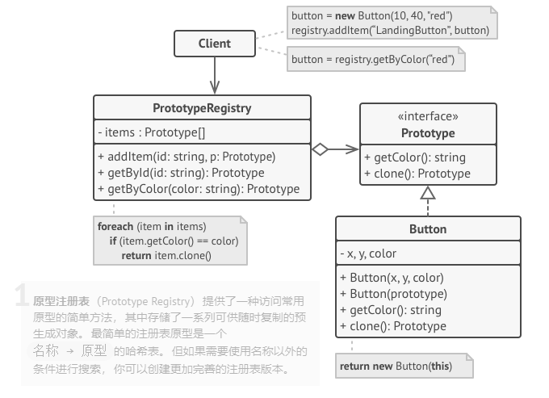

# 1.4 原型模式

亦称： 克隆、Clone、Prototype

**原型模式** 是一种创建型设计模式， 使你能够复制已有对象， 而又无需使代码依赖它们所属的类。


### 模型结构

**基本实现** ：


**原型注册表实现:** 



### 代码示例

- 原型及具体类型代码：

```Kotlin
// 基础原型
interface Cloneable {
    fun clone(): Cloneable
}

open class Shape(val name:String): Cloneable {
    override fun clone(): Shape {
        return Shape(name)
    }

    override fun toString(): String {
        return "name = $name "
    }
}

// 具体原型。克隆方法会创建一个新对象并将其传递给构造函数。直到构造函数运
// 行完成前，它都拥有指向新克隆对象的引用。因此，任何人都无法访问未完全生
// 成的克隆对象。这可以保持克隆结果的一致。
class Rectangle(var width: Int, var height: Int, name: String): Shape(name) {

    constructor(rectangle: Rectangle):
            this(rectangle.width, rectangle.height, rectangle.name)

    override fun clone(): Rectangle {
        return Rectangle(this)
    }

    override fun toString(): String {
        return  "[${super.toString()} width = $width height = $height]"
    }
}

class Circle(var radius: Int, name: String): Shape(name) {

    constructor(circle: Circle): this(circle.radius, circle.name)

    override fun clone(): Circle {
        return Circle(this)
    }

    override fun toString(): String {
        return  "[${super.toString()} + radius = $radius]"
    }
}

```


- 客户端代码：

```Kotlin

fun main() {
    val circle = Circle(5, "Circle")
    val rectangle = Rectangle(8, 10, "Rectangle")

    checkClone(circle)
    checkClone(rectangle)
}

fun checkClone(shape: Shape) {
    println("shape = $shape; clone = ${shape.clone()}")
}
//输出结果
//shape = [name = Circle  + radius = 5]; clone = [name = Circle  + radius = 5]
//shape = [name = Rectangle  width = 8 height = 10]; clone = [name = Rectangle  width = 8 height = 10] 
```


对于java语言的，可直接实现 Cloneable接口,并且进行重写clone方法， 而kotlin实现 Cloneable后无法重写 clone方法并且clone方法是protected;

### 应用场景

- 如果你需要复制一些对象， 同时又希望代码独立于这些对象所属的具体类， 可以使用原型模式。

&ensp;&ensp;&ensp;&ensp;这一点考量通常出现在代码需要处理第三方代码通过接口传递过来的对象时。 即使不考虑代码耦合的情况， 你的代码也不能依赖这些对象所属的具体类， 因为你不知道它们的具体信息。

&ensp;&ensp;&ensp;&ensp;原型模式为客户端代码提供一个通用接口， 客户端代码可通过这一接口与所有实现了克隆的对象进行交互， 它也使得客户端代码与其所克隆的对象具体类独立开来。

-  如果子类的区别仅在于其对象的初始化方式， 那么你可以使用该模式来减少子类的数量。 别人创建这些子类的目的可能是为了创建特定类型的对象。

&ensp;&ensp;&ensp;&ensp;在原型模式中， 你可以使用一系列预生成的、 各种类型的对象作为原型。

&ensp;&ensp;&ensp;&ensp;客户端不必根据需求对子类进行实例化， 只需找到合适的原型并对其进行克隆即可。

### 优缺点：

- 你可以克隆对象， 而无需与它们所属的具体类相耦合。

- 你可以克隆预生成原型， 避免反复运行初始化代码。

- 你可以更方便地生成复杂对象。

- 你可以用继承以外的方式来处理复杂对象的不同配置。

- 缺点：克隆包含循环引用的复杂对象可能会非常麻烦。

### 与其它模式的关系

- 在许多设计工作的初期都会使用工厂方法模式 （较为简单， 而且可以更方便地通过子类进行定制）， 随后演化为使用抽象工厂模式、 原型模式或生成器模式 （更灵活但更加复杂）。

- 抽象工厂模式通常基于一组工厂方法， 但你也可以使用原型模式来生成这些类的方法。

- 原型可用于保存命令模式的历史记录。


- 大量使用组合模式和装饰模式的设计通常可从对于原型的使用中获益。 你可以通过该模式来复制复杂结构， 而非从零开始重新构造。

- 原型并不基于继承， 因此没有继承的缺点。 另一方面， 原型需要对被复制对象进行复杂的初始化。 工厂方法基于继承， 但是它不需要初始化步骤

- 有时候原型可以作为备忘录模式的一个简化版本， 其条件是你需要在历史记录中存储的对象的状态比较简单， 不需要链接其他外部资源， 或者链接可以方便地重建。


- 抽象工厂、 生成器和原型都可以用单例模式来实现。

