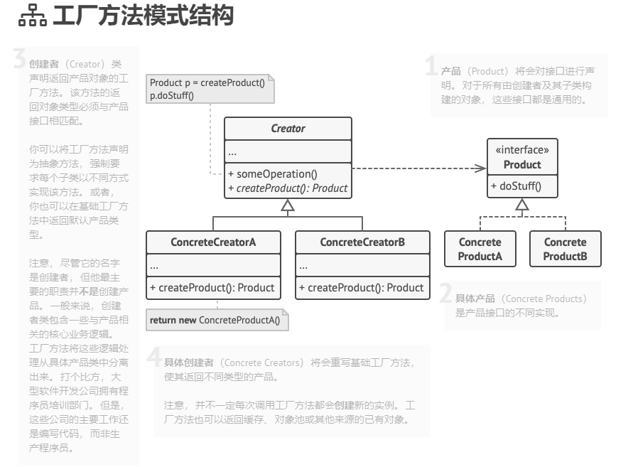

# 1.1 工厂方法

#### 意图

实现要点： 定义一个创建对象的接口，让其子类自己决定实例化哪一个工厂类，工厂模式使其创建过程延迟到子类进行；


简单说就是了提供代码结构的扩展性，屏蔽第一个功能类中的具体实现逻辑。让外部可以更加简单的只是知道调用即可，同时，这也是去掉众多ifelse的方式。

#### 模式结构



#### 实现代码

以下示例演示了如何使用**工厂方法** 开发跨平台 UI （用户界面） 组件， 并同时避免客户代码与具体 UI 类之间的耦合。


产品接口及具体产品：

```Kotlin
// 产品接口中将声明所有具体产品都必须实现的操作。
interface Button {
    fun render()
    fun onClick()
}
// 具体产品需提供产品接口的各种实现。
class HTMLButton : Button {
    override fun render() {
        println("[render]HTML Button")
    }

    override fun onClick() {
        println("[onClick]HTML Button")
    }
}

// 具体产品需提供产品接口的各种实现。
class WindowsButton : Button {
    override fun render() {
        println("[render]Window Button")
    }

    override fun onClick() {
        println("[onClick]Window Button")
    }
} 
```


创建者类及具体创建者:

```Kotlin
 /**
 * 创建者类声明的工厂方法必须返回一个产品类的对象。创建者的子类通常会提供该方法的实现。
 */
abstract class Dialog {
    /**
     * 创建者还可提供一些工厂方法的默认实现。
     */
    abstract fun createButton():Button

    /**
     * 请注意，创建者的主要职责并非是创建产品。其中通常会包含一些核心业务逻辑，这些逻辑依赖于由工厂方法返回的产品对象。
     * 子类可通过重写工厂方法并使其返回不同类型的产品来间接修改业务逻辑。
     */
    fun render() {
        val okButton = createButton()
        okButton.onClick()
        okButton.render()
    }
}

class WebDialog: Dialog() {
    override fun createButton(): Button {
        return HTMLButton()
    }
}

class WindowsDialog: Dialog() {
    override fun createButton(): Button {
        return WindowsButton()
    }
} 
```


使用代码：

```Kotlin
fun main(args: Array<String>) {
    val dialog = if (getOs() == "window") {
        WindowsDialog()
    } else {
        WebDialog()
    }
    dialog.createButton()
    dialog.render()
}

private fun getOs(): String{
    return "window"
}
```


#### 适用场景

- 当你在编写代码的过程中， 如果无法预知对象确切类别及其依赖关系时， 可使用工厂方法。

- 如果你希望用户能扩展你软件库或框架的内部组件， 可使用工厂方法。

- 如果你希望复用现有对象来节省系统资源， 而不是每次都重新创建对象， 可使用工厂方法。

#### 工厂方法模式优缺点

缺点：

- 应用工厂方法模式需要引入许多新的子类， 代码可能会因此变得更复杂。 最好的情况是将该模式引入创建者类的现有层次结构中。

优点： 

- 你可以避免创建者和具体产品之间的紧密耦合。

- 单一职责原则。 你可以将产品创建代码放在程序的单一位置， 从而使得代码更容易维护。

- 开闭原则。 无需更改现有客户端代码， 你就可以在程序中引入新的产品类型。

与其他模式的关系：

- 在许多设计工作的初期都会使用[工厂方法模式](https://refactoringguru.cn/design-patterns/factory-method) （较为简单， 而且可以更方便地通过子类进行定制）， 随后演化为使用[抽象工厂模式](https://refactoringguru.cn/design-patterns/abstract-factory)、 [原型模式](https://refactoringguru.cn/design-patterns/prototype)或[生成器模式](https://refactoringguru.cn/design-patterns/builder) （更灵活但更加复杂）。

- [抽象工厂模式](https://refactoringguru.cn/design-patterns/abstract-factory)通常基于一组[工厂方法](https://refactoringguru.cn/design-patterns/factory-method)， 但你也可以使用[原型模式](https://refactoringguru.cn/design-patterns/prototype)来生成这些类的方法。

- 你可以同时使用[工厂方法](https://refactoringguru.cn/design-patterns/factory-method)和[迭代器模式](https://refactoringguru.cn/design-patterns/iterator)来让子类集合返回不同类型的迭代器， 并使得迭代器与集合相匹配。

- [原型](https://refactoringguru.cn/design-patterns/prototype)并不基于继承， 因此没有继承的缺点。 另一方面， _原型_需要对被复制对象进行复杂的初始化。 [工厂方法](https://refactoringguru.cn/design-patterns/factory-method)基于继承， 但是它不需要初始化步骤。

- [工厂方法](https://refactoringguru.cn/design-patterns/factory-method)是[模板方法模式](https://refactoringguru.cn/design-patterns/template-method)的一种特殊形式。 同时， _工厂方法_可以作为一个大型_模板方法_中的一个步骤。

更多详细请参考：

[https://refactoringguru.cn/design-patterns/factory-method](https://refactoringguru.cn/design-patterns/factory-method)

