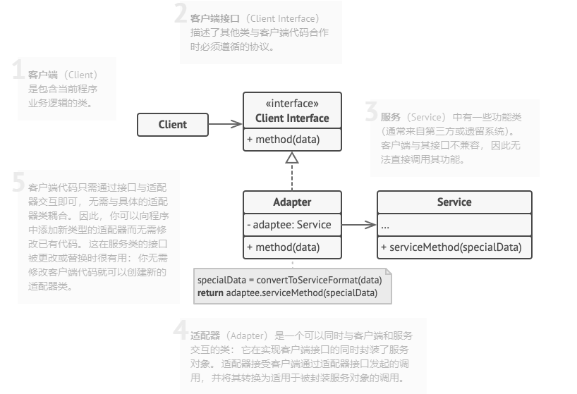

# 2.1 适配器模式

亦称： 封装器模式、Wrapper、Adapter

**适配器模式** 是一种结构型设计模式， 它能使接口不兼容的对象能够相互合作。


适配器模式通过封装对象将复杂的转换过程隐藏于幕后。 被封装的对象甚至察觉不到适配器的存在。 

适配器不仅可以转换不同格式的数据， 其还有助于采用不同接口的对象之间的合作。 它的运作方式如下：

1. 适配器实现与其中一个现有对象兼容的接口。

2. 现有对象可以使用该接口安全地调用适配器方法。

3. 适配器方法被调用后将以另一个对象兼容的格式和顺序将请求传递给该对象。

有时你甚至可以创建一个双向适配器来实现双向转换调用。


## 模式结构

#### 对象适配器:

实现时使用了构成原则： 适配器实现了其中一个对象的接口， 并对另一个对象进行封装。 所有流行的编程语言都可以实现适配器。



### 伪代码

下列**适配器**模式演示基于经典的 “方钉和圆孔” 问题。


适配器假扮成一个圆钉 （Round­Peg）， 其半径等于方钉 （Square­Peg） 横截面对角线的一半 （即能够容纳方钉的最小外接圆的半径）。

**现有不兼容的代码：**

```kotlin
// 假设你有两个接口相互兼容的类：圆孔（RoundHole）和圆钉（RoundPeg）。
class RoundHole is
    constructor RoundHole(radius) { ... }

    method getRadius() is
        // 返回孔的半径。

    method fits(peg: RoundPeg) is
        return this.getRadius() >= peg.getRadius()

class RoundPeg is
    constructor RoundPeg(radius) { ... }

    method getRadius() is
        // 返回钉子的半径。


// 但还有一个不兼容的类：方钉（SquarePeg）。
class SquarePeg is
    constructor SquarePeg(width) { ... }

    method getWidth() is
        // 返回方钉的宽度。
```

**适配器类：**

```kotlin
// 适配器类让你能够将方钉放入圆孔中。它会对 RoundPeg 类进行扩展，以接收适
// 配器对象作为圆钉。
class SquarePegAdapter extends RoundPeg is
    // 在实际情况中，适配器中会包含一个 SquarePeg 类的实例。
    private field peg: SquarePeg

    constructor SquarePegAdapter(peg: SquarePeg) is
        this.peg = peg

    method getRadius() is
        // 适配器会假扮为一个圆钉，
        // 其半径刚好能与适配器实际封装的方钉搭配起来。
        return peg.getWidth() * Math.sqrt(2) / 2

```

**客户端代码：**

```kotlin
// 客户端代码中的某个位置。
hole = new RoundHole(5)
rpeg = new RoundPeg(5)
hole.fits(rpeg) // true

small_sqpeg = new SquarePeg(5)
large_sqpeg = new SquarePeg(10)
hole.fits(small_sqpeg) // 此处无法编译（类型不一致）。

small_sqpeg_adapter = new SquarePegAdapter(small_sqpeg)
large_sqpeg_adapter = new SquarePegAdapter(large_sqpeg)
hole.fits(small_sqpeg_adapter) // true
hole.fits(large_sqpeg_adapter) // false
```

### 应用场景

- **当你希望使用某个类， 但是其接口与其他代码不兼容时， 可以使用适配器类。**
  适配器模式允许你创建一个中间层类， 其可作为代码与遗留类、 第三方类或提供怪异接口的类之间的转换器。

-  **如果您需要复用这样一些类， 他们处于同一个继承体系， 并且他们又有了额外的一些共同的方法， 但是这些共同的方法不是所有在这一继承体系中的子类所具有的共性。**
  你可以扩展每个子类， 将缺少的功能添加到新的子类中。 但是， 你必须在所有新子类中重复添加这些代码， 这样会使得代码有[坏味道](https://refactoringguru.cn/smells/duplicate-code)。

  将缺失功能添加到一个适配器类中是一种优雅得多的解决方案。 然后你可以将缺少功能的对象封装在适配器中， 从而动态地获取所需功能。 如要这一点正常运作， 目标类必须要有通用接口， 适配器的成员变量应当遵循该通用接口。 这种方式同[装饰](https://refactoringguru.cn/design-patterns/decorator)模式非常相似。

### 实现方式

1. 确保至少有两个类的接口不兼容：
   - 一个无法修改 （通常是第三方、 遗留系统或者存在众多已有依赖的类） 的功能性*服务*类。
   - 一个或多个将受益于使用服务类的*客户端*类。
2. 声明客户端接口， 描述客户端如何与服务交互。
3. 创建遵循客户端接口的适配器类。 所有方法暂时都为空。
4. 在适配器类中添加一个成员变量用于保存对于服务对象的引用。 通常情况下会通过构造函数对该成员变量进行初始化， 但有时在调用其方法时将该变量传递给适配器会更方便。
5. 依次实现适配器类客户端接口的所有方法。 适配器会将实际工作委派给服务对象， 自身只负责接口或数据格式的转换。
6. 客户端必须通过客户端接口使用适配器。 这样一来， 你就可以在不影响客户端代码的情况下修改或扩展适配器。

### 优缺点

- 优点：
  - 单一职责原则， 你可以将接口或数据转换代码从程序主要业务逻辑中分离。
  - *开闭原则*。 只要客户端代码通过客户端接口与适配器进行交互， 你就能在不修改现有客户端代码的情况下在程序中添加新类型的适配器。
- 缺点：
  - 代码整体复杂度增加， 因为你需要新增一系列接口和类。 有时直接更改服务类使其与其他代码兼容会更简单。

### 与其他模式的关系

- [桥接模式](https://refactoringguru.cn/design-patterns/bridge)通常会于开发前期进行设计， 使你能够将程序的各个部分独立开来以便开发。 另一方面， [适配器模式](https://refactoringguru.cn/design-patterns/adapter)通常在已有程序中使用， 让相互不兼容的类能很好地合作。
- [适配器](https://refactoringguru.cn/design-patterns/adapter)可以对已有对象的接口进行修改， [装饰模式](https://refactoringguru.cn/design-patterns/decorator)则能在不改变对象接口的前提下强化对象功能。 此外， *装饰*还支持递归组合， *适配器*则无法实现。
- [适配器](https://refactoringguru.cn/design-patterns/adapter)能为被封装对象提供不同的接口， [代理模式](https://refactoringguru.cn/design-patterns/proxy)能为对象提供相同的接口， [装饰](https://refactoringguru.cn/design-patterns/decorator)则能为对象提供加强的接口。
- [外观模式](https://refactoringguru.cn/design-patterns/facade)为现有对象定义了一个新接口， [适配器](https://refactoringguru.cn/design-patterns/adapter)则会试图运用已有的接口。 *适配器*通常只封装一个对象， *外观*通常会作用于整个对象子系统上。
- [桥接](https://refactoringguru.cn/design-patterns/bridge)、 [状态模式](https://refactoringguru.cn/design-patterns/state)和[策略模式](https://refactoringguru.cn/design-patterns/strategy) （在某种程度上包括[适配器](https://refactoringguru.cn/design-patterns/adapter)） 模式的接口非常相似。 实际上， 它们都基于[组合模式](https://refactoringguru.cn/design-patterns/composite)——即将工作委派给其他对象， 不过也各自解决了不同的问题。 模式并不只是以特定方式组织代码的配方， 你还可以使用它们来和其他开发者讨论模式所解决的问题。

> 本文笔记于https://refactoringguru.cn/design-patterns/adapter， 仅供个人学习使用；