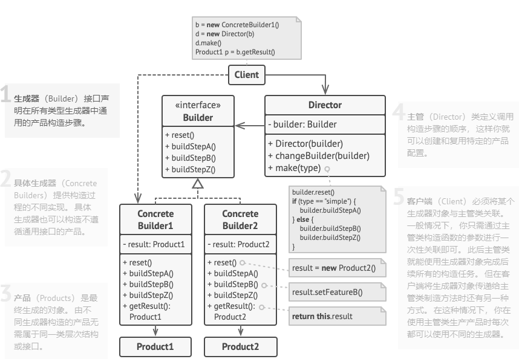

# 1.3 生成器模式

亦称： 建造者模式、Builder

**生成器模式** 是一种创建型设计模式， 使你能够分步骤创建复杂对象。 该模式允许你使用相同的创建代码生成不同类型和形式的对象。


### 生成器模式结构



### 实现代码示例：

关于**生成器** 模式的例子演示了你可以如何复用相同的对象构造代码来生成不同类型的产品——例如汽车 （Car）——及其相应的使用手册 （Manual）。


汽车是一个复杂对象， 有数百种不同的制造方法。 我们没有在 `汽车`类中塞入一个巨型构造函数， 而是将汽车组装代码抽取到单独的汽车生成器类中。 该类中有一组方法可用来配置汽车的各种部件。
如果客户端代码需要组装一辆与众不同、 精心调教的汽车， 它可以直接调用生成器。 或者， 客户端可以将组装工作委托给主管类， 因为主管类知道如何使用生成器制造最受欢迎的几种型号汽车。

- 产品代码：

```Kotlin
// 只有当产品较为复杂且需要详细配置时，使用生成器模式才有意义。下面的两个
// 产品尽管没有同样的接口，但却相互关联。
data class Car(val seat: String?, val engine: String?, val tripComputer: String?, val gps: String?)

// 用户使用手册应该根据汽车配置进行编制，并介绍汽车的所有功能。
data class CarManual(val seat: String?, val engine: String?, val tripComputer: String?, val gps: String?)
```


- Builder代码：

```Kotlin
// 生成器接口声明了创建产品对象不同部件的方法。
interface Builder {
    fun reset(): Builder
    fun setSeats(seat: String): Builder
    fun setEngine(engine: String): Builder
    fun setTripComputer(tripComputer: String): Builder
    fun setGPS(gps: String): Builder
}

// 具体生成器类将遵循生成器接口并提供生成步骤的具体实现。你的程序中可能会
// 有多个以不同方式实现的生成器变体。
class CarBuilder : Builder {
    var seat: String? = null
    var engine: String? = null
    var tripComputer: String? = null
    var gps: String? = null

    override fun reset(): Builder {
        seat = null
        engine = null
        tripComputer = null
        gps = null
        return this
    }

    override fun setSeats(seat: String): CarBuilder {
        this.seat = seat
        return this
    }

    override fun setEngine(engine: String): CarBuilder {
        this.engine = seat
        return this
    }

    override fun setTripComputer(tripComputer: String): CarBuilder {
        this.tripComputer = seat
        return this
    }

    override fun setGPS(gps: String): CarBuilder {
        this.gps = seat
        return this
    }

    fun getProduct(): Car {
        return Car(seat, engine, tripComputer, gps)
    }
}

// 生成器与其他创建型模式的不同之处在于：它让你能创建不遵循相同接口的产品。
class CarManualBuilder : Builder {
    var seat: String? = null
    var engine: String? = null
    var tripComputer: String? = null
    var gps: String? = null

    override fun reset(): Builder {
        seat = null
        engine = null
        tripComputer = null
        gps = null
        return this
    }

    override fun setSeats(seat: String): CarManualBuilder {
        this.seat = seat
        return this
    }

    override fun setEngine(engine: String): CarManualBuilder {
        this.engine = seat
        return this
    }

    override fun setTripComputer(tripComputer: String): CarManualBuilder {
        this.tripComputer = seat
        return this
    }

    override fun setGPS(gps: String): CarManualBuilder {
        this.gps = seat
        return this
    }

    fun getProduct(): CarManual {
        return CarManual(seat, engine, tripComputer, gps)
    }
}
```


- 主管代码：

```Kotlin
// 主管只负责按照特定顺序执行生成步骤。其在根据特定步骤或配置来生成产品时
// 会很有帮助。由于客户端可以直接控制生成器，所以严格意义上来说，主管类并
// 不是必需的。
class Director {
    fun createSportCar(builder: CarBuilder): Car {
        builder.reset()
                .setSeats("2座")
                .setEngine("8引擎")
                .setTripComputer("Mac")
                .setGPS("北斗GPS")
        return builder.getProduct()
    }

    fun createSUVCar(builder: CarBuilder): Car {
        builder.reset()
                .setSeats("8座")
                .setEngine("4引擎")
                .setTripComputer("Android")
        return builder.getProduct()
    }

    fun createSportCarManual(builder: CarManualBuilder): CarManual {
        builder.reset()
                .setSeats("2座真皮")
                .setEngine("8引擎提供强大动力")
                .setTripComputer("Mac最新版本行车电脑")
                .setGPS("北斗GPS，精确定位")
        return builder.getProduct()
    }
}
```


- Client代码：

```Kotlin
// 客户端代码会创建生成器对象并将其传递给主管，然后执行构造过程。最终结果
// 将需要从生成器对象中获取。
fun main() {
    val director = Director()

    val carBuilder = CarBuilder()
    val sportCar = director.createSportCar(carBuilder)
    val sportCarManual = director.createSportCarManual(CarManualBuilder())
    val suvCar = director.createSUVCar(carBuilder)
}
```


### 应用场景

- 使用生成器模式可避免 “重叠构造函数 （telescopic constructor）” 的出现。

&ensp;&ensp;&ensp;&ensp;假设你的构造函数中有十个可选参数， 那么调用该函数会非常不方便； 因此， 你需要重载这个构造函数， 新建几个只有较少参数的简化版。 但这些构造函数仍需调用主构造函数， 传递一些默认数值来替代省略掉的参数。

- 当你希望使用代码创建不同形式的产品 （例如石头或木头房屋） 时， 可使用生成器模式。

&ensp;&ensp;&ensp;&ensp;如果你需要创建的各种形式的产品， 它们的制造过程相似且仅有细节上的差异， 此时可使用生成器模式。

&ensp;&ensp;&ensp;&ensp;基本生成器接口中定义了所有可能的制造步骤， 具体生成器将实现这些步骤来制造特定形式的产品。 同时， 主管类将负责管理制造步骤的顺序。

- 使用生成器构造[组合](https://refactoringguru.cn/design-patterns/composite)树或其他复杂对象。

&ensp;&ensp;&ensp;&ensp;生成器模式让你能分步骤构造产品。 你可以延迟执行某些步骤而不会影响最终产品。 你甚至可以递归调用这些步骤， 这在创建对象树时非常方便。

&ensp;&ensp;&ensp;&ensp;生成器在执行制造步骤时， 不能对外发布未完成的产品。 这可以避免客户端代码获取到不完整结果对象的情况。

### 优缺点

- 你可以分步创建对象， 暂缓创建步骤或递归运行创建步骤。

- 生成不同形式的产品时， 你可以复用相同的制造代码。

- *单一职责原则* 。 你可以将复杂构造代码从产品的业务逻辑中分离出来。

- 缺点：由于该模式需要新增多个类， 因此代码整体复杂程度会有所增加。

### 与其他模式的关系

- 在许多设计工作的初期都会使用工厂方法模式 （较为简单， 而且可以更方便地通过子类进行定制）， 随后演化为使用抽象工厂模式、 原型模式或生成器模式 （更灵活但更加复杂）。

- 生成器重点关注如何分步生成复杂对象。 抽象工厂专门用于生产一系列相关对象。 _抽象工厂_会马上返回产品， _生成器_则允许你在获取产品前执行一些额外构造步骤。

- 你可以在创建复杂组合模式树时使用生成器， 因为这可使其构造步骤以递归的方式运行。

- 你可以结合使用生成器和桥接模式： _主管_类负责抽象工作， 各种不同的_生成器_负责_实现_工作。

- 抽象工厂、 生成器和原型都可以用单例模式来实现。

