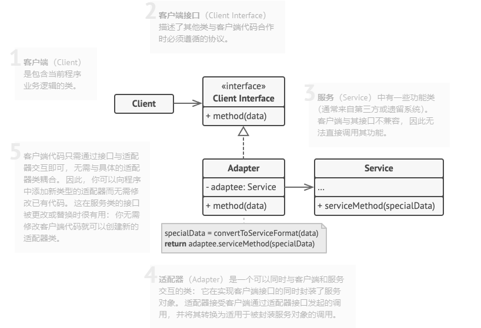

# 2.1 适配器模式

亦称： 封装器模式、Wrapper、Adapter

**适配器模式** 是一种结构型设计模式， 它能使接口不兼容的对象能够相互合作。

适配器模式通过封装对象将复杂的转换过程隐藏于幕后。 被封装的对象甚至察觉不到适配器的存在。 

适配器不仅可以转换不同格式的数据， 其还有助于采用不同接口的对象之间的合作。 它的运作方式如下：

1. 适配器实现与其中一个现有对象兼容的接口。

2. 现有对象可以使用该接口安全地调用适配器方法。

3. 适配器方法被调用后将以另一个对象兼容的格式和顺序将请求传递给该对象。

有时你甚至可以创建一个双向适配器来实现双向转换调用。

## 模式结构

